# Star Discriminator Federated Learning GAN (StarDFLGAN)
This is the code and experimental setup for StarDFLGAN. It is named inspired from the Star network topology of one server in the middle talking back and forth to many clients. FLGANs are GANs trained in a federated setting. DGANs are GANs were the discriminator is decoupled from the generated. Combining them we get StarDFLGANs!!.

In this architecture we have one server running a generator and discriminator. All the clients run only the decoupled discriminator. This reduces computation cost at the clients, which is important and necessary in Federated Learning settings.

# Dependencies
1. PyTorch >= 1.0.0
2. torchvision >= 0.2.1
3. scikit-learn >= 0.23.1
4. Flower >= 1.1.0
4. Pytorch-fid == 0.2.1


# Instructions to generate data splits
| Parameter                      | Description                                 |
| ----------------------------- | ---------------------------------------- |
| `--dir_download`              | Directory where the dataset is downloaded |
| `--logs_dir`                  | Directory where the logs are stored       |
| `--split_type`                | Type of split to be performed. iid or noniid             |
| `--beta_value`                | Beta value for non-iid split. 0.1,0.5,5 etc             |
| `--dataset`                   | Dataset to be used. mnist, cifar10             |
| `--num_clients`               | Number of clients to be used. 2,5,10 etc             |
| `--result_directory`          | Directory where the split data is stored             |

For example, to generate for 5 clients and 0.5 beta value for non-iid split for MNIST dataset, run the following command:

```bash
cd experiments_folder/MOON && python split_dataset.py --dir_download ../current_dir --logs_dir ../logs --split_type noniid --beta_value 0.5 --dataset mnist --num_clients 5 --result_directory ../../mnist_splits_5_05_noniid &
```

# Instructions to run the experiments

1. create a new virtual environment
1. pip install -r requirements.txt
1. ./run_mnist_basic_exp.sh
1. The resulting generated images by GAN trained using federated learning is saved in gan_images folder 
   which will be created once the code completes one epoch of training. 


# Results
StarDFLGan gives 50% improved results than FLGAN on IID data

For IID data, as number of clients increase we do not observe any degradation of performance. Hence the system is stable.

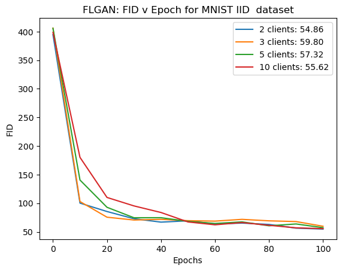
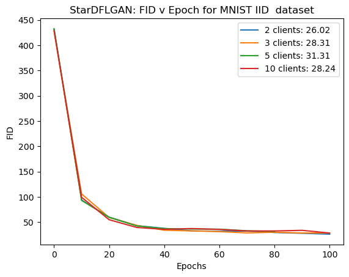

As number of clients increase we can see that the generator model is able to perform better when the data is less skewed (higher beta)

Beta is a parameter in the Dirichlet distribution representing non-IID data. Lower the value of beta, the more skewed the data is.

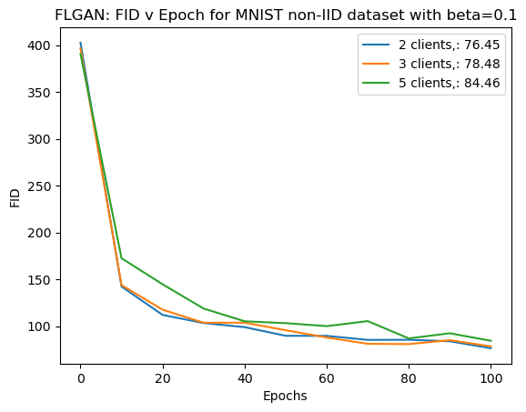
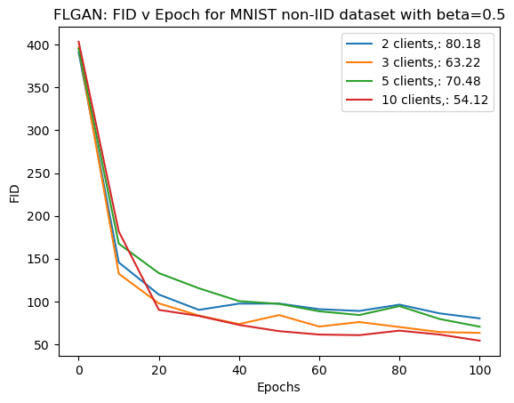
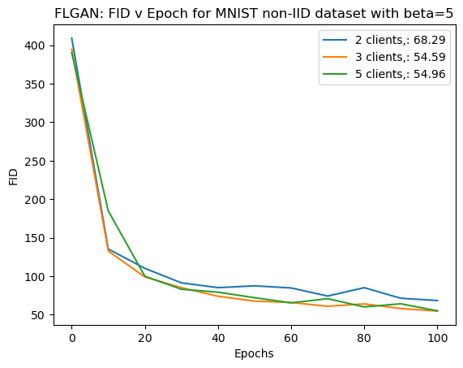

STARDFLGAN gives 20% improved results for less non-IID data (beta=5) 

But performs poorly compared to FLGANs for highly skewed data. To mitigate this we employ FedBN.

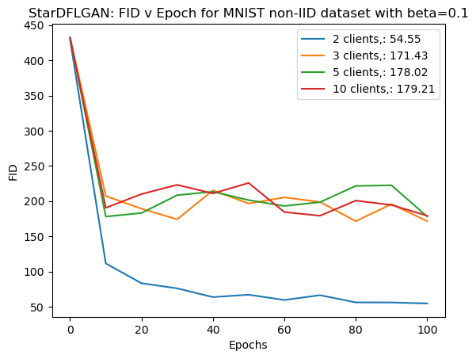
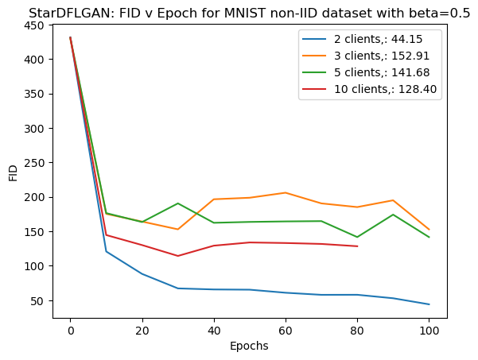
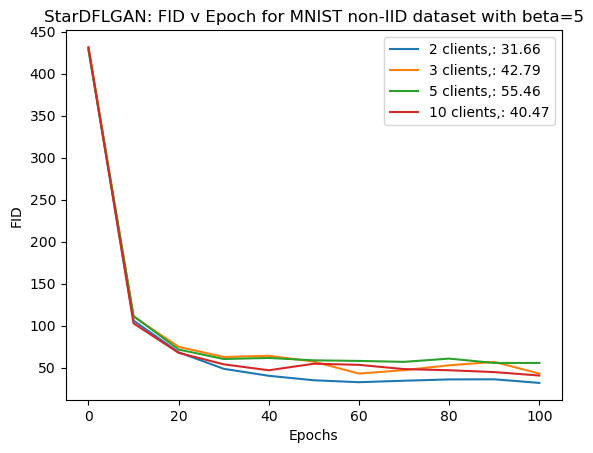

To tackle highly skewed data we employed FedBN. We observe that for non-IID data FedBN gives 20% improvement for MNIST and 65% improvement for CIFAR10

Also, we see that for IID data, using FedBN does not degrade the results (top right graph). Hence it can be used in any setting to get better results

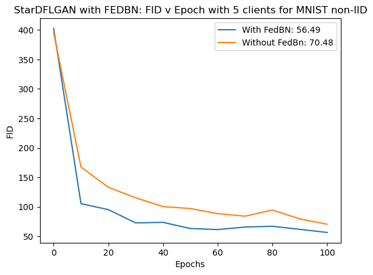
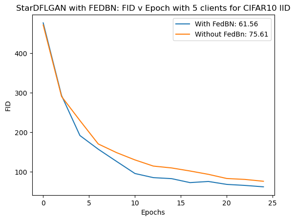
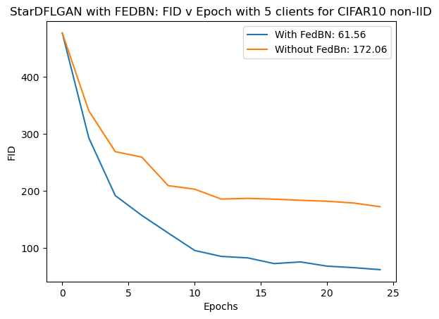
